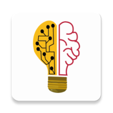

# Electronic-Institute
An electronic educational platform that provides a comprehensive environment for distance education and supports the teaching of school curricula and university curricula, so that the student is able through it to absorb previously archived lessons with electronic tests written by professors.

#### Compatible with **API Level 21** and higher
#### Linked with firebase(database - real-time database - storage - authentication - cloud messaging)

#### This application is created with **Flutter** framework as a privte project **Bee Academy** and uploaded to gitlab please visit: https://gitlab.com/majd.zain/beeacademy   

